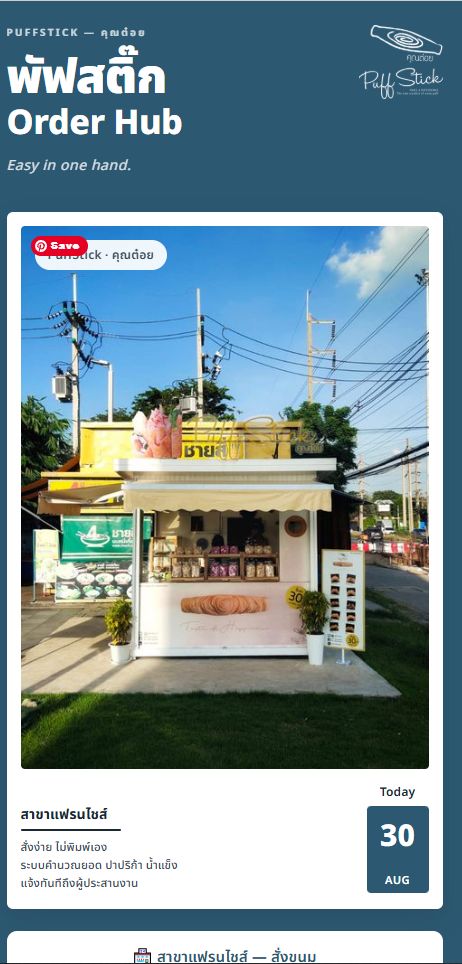
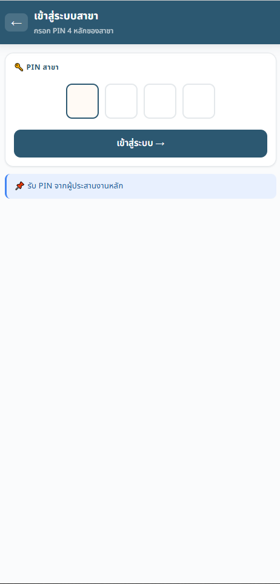
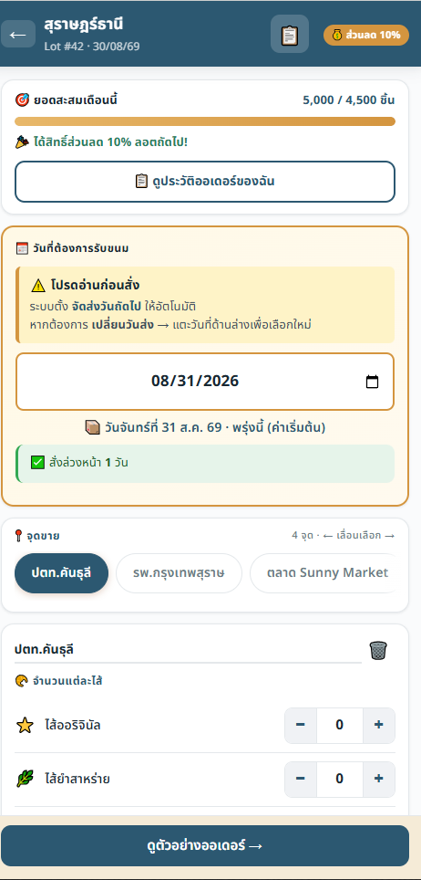
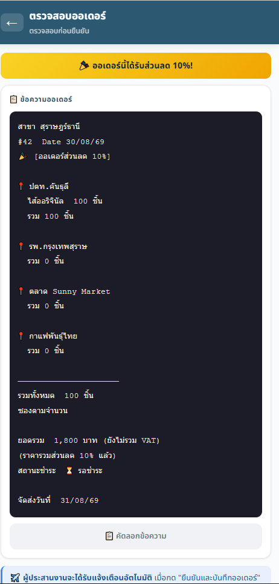
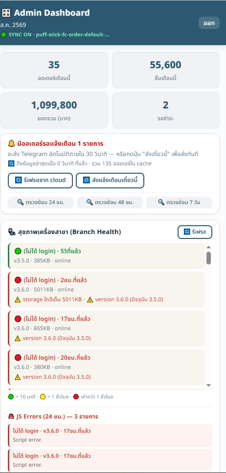

# PuffStick Order Hub — พัฟสติ๊ก

> **Easy in one hand.** ระบบสั่งขนมสำหรับสาขาแฟรนไชส์ PuffStick FC — สั่งง่าย ไม่ต้องพิมพ์เอง
> **Live:** https://maya4artdev.github.io/puffstick-order/

Branch-facing ordering PWA สำหรับสาขาแฟรนไชส์ PuffStick (~20–30 สาขา). สาขากรอก PIN → เลือกไส้/จำนวน → ระบบคำนวณยอด + ส่วนลดอัตโนมัติ → ยืนยัน → แจ้งเตือนเข้า Telegram ผู้ประสานงาน. ฝั่งแอดมินมี dashboard ยอดขาย + สุขภาพเครื่องสาขาแบบเรียลไทม์.

---

## Features

- **สั่งของฝั่งสาขา** — เข้าระบบด้วย PIN 4 หลัก, เลือกไส้ (ออริจินัล/ยำสาหร่าย/…) + จำนวนต่อจุดขาย, ตั้งวันรับขนม
- **ส่วนลดอัตโนมัติ** — ถึงยอดสะสมรายเดือน → ปลดล็อกส่วนลด (เช่น 10%) ให้ล็อตถัดไป
- **ตรวจสอบก่อนยืนยัน** — สรุปออเดอร์ (สาขา/จุดขาย/ยอด/ส่วนลด/วันส่ง) ก่อนกดยืนยัน
- **แจ้งเตือน Telegram** — ยืนยันออเดอร์ → ส่งเข้ากลุ่มผู้ประสานงานอัตโนมัติ
- **Admin Dashboard** — ยอดออเดอร์/ชิ้น/บาทรายเดือน, ออเดอร์รอแจ้งเตือน, dispatcher
- **Branch Health telemetry** — ปิงทุก 5 นาที → สถานะ 🟢🟡🔴 ต่อสาขา + เวอร์ชัน + JS error viewer
- **Cloudflare Worker failsafe** — cron 24/7 กัน Telegram หลุด

---

## Screenshots

| Landing | Branch Login | Order Flow |
|---|---|---|
|  |  |  |

| Order Summary | Admin Dashboard |
|---|---|
|  |  |

---

## Tech stack

- **Frontend:** single-file vanilla HTML/JS PWA (no framework, no build step)
- **Backend:** Firebase Realtime Database
- **Notifications:** Telegram Bot
- **Hosting:** GitHub Pages → `maya4artdev.github.io/puffstick-order/`
- **Failsafe:** Cloudflare Worker (cron)

---

## Repo structure

```
puffstick-order/
├── index.html          ← PRODUCTION (deploys to GitHub Pages — must stay at root)
├── AGENTS.md           ← agent instructions (Antigravity / cross-agent)
├── CLAUDE.md           ← Claude Code entry (imports AGENTS.md)
├── AI_LOCK.md          ← agent guardrails
├── BUILDER_CODEX.md    ← build methodology reference
├── CAPTURE_LOG.md      ← strategic learnings (human)
├── MEMORY.md           ← operational mistakes (AI)
├── docs/               ← HANDOFF, session template, design, screenshots
├── skills/             ← on-demand agent skills
└── data/               ← business data (gitignored — never public)
```

> ⚠️ **`index.html` must stay at the repo root** — the GitHub Pages URL that every branch
> uses depends on it. Moving it breaks production ordering for all branches.

---

## For developers / AI agents

Read **`AGENTS.md`** first — it carries the hard rules (vanilla-only, `data-id`
event delegation, no nested backtick literals, single source of truth, admin/dispatch
caution) and the Context Hub protocol. Claude Code reads `CLAUDE.md` which imports it.

**Deploy:** push to `main` → GitHub Pages redeploys (~1–2 min). Since this is live for
real branches, verify the URL loads after every push.

---

*PuffStick FC · บจก. 92 คำอิ่ม*
